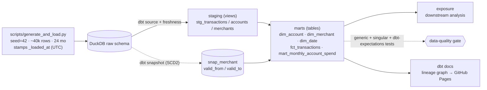

# finance-warehouse-dbt

> A **dbt-core + DuckDB** dimensional warehouse over the shared finance transaction corpus — star
> schema, **SCD Type 2** history, **data contracts**, a layered test suite, lineage docs, and CI.
> **Docker-free, $0, no cloud account.** Runs end-to-end on a laptop with `dbt build` and is gated in CI.

This is the **transform / modeling layer** of a four-repo portfolio over one shared `seed=42` finance
corpus — the piece an analytics engineer actually owns:

| Repo | Layer | Role |
|---|---|---|
| [`finance-pipeline`](https://github.com/HarshPatel7x/finance-pipeline) | ingestion / OLTP | source of the transaction data |
| [`lakehouse-iceberg-finance`](https://github.com/HarshPatel7x/lakehouse-iceberg-finance) | open-table storage | Iceberg table format, time-travel |
| [`finance-pipeline-rag`](https://github.com/HarshPatel7x/finance-pipeline-rag) | AI retrieval | RAG over the corpus |
| **this repo** | **transform / modeling** | **dbt star schema + SCD2 + tests + contracts** |

> Same corpus, different layer — deliberate portfolio cohesion, not the same dataset repeated. The
> generator here **expands** the corpus to ~40k rows over 24 months across multiple accounts and
> merchants whose attributes change over time, because SCD2 and freshness are only demonstrable on data
> that actually changes.

## Architecture



## What it demonstrates (and what backs it)

Backs the DE resume's *dbt Warehouse + SCD2 + CI/CD* project line. Concretely:
- **Dimensional modeling** — staging → marts star schema with a declared grain and surrogate keys.
- **SCD Type 2 history** — a `dbt snapshot` that captures real merchant attribute changes (exercised by a
  v1 → v2 reload, not a one-shot static load).
- **Data quality as a gate** — generic + singular + `dbt-expectations` tests + **enforced model contracts**
  + a YAML data contract (schema, freshness SLA, row-count baseline, consumer list), all blocking in CI.
- **Lineage + docs** — `dbt docs` DAG deployed to GitHub Pages.

## Metrics (measured by `dbt build`, 2026-06-05)

| Metric | Value |
|---|---|
| Models (3 staging + 5 marts) | **8** |
| Data tests (generic + singular + `dbt_expectations`) | **44**, **100% pass** |
| Mart columns with a column-level test | **12 / 17 (71%)** — plus the entire fact under an **enforced** schema contract |
| Rows modeled (`fct_transactions`) | **40,000** over 24 months · 8 accounts · 40 merchants |
| SCD2 versions / closed-out (v1→v2 reload) | **46 / 6** |
| `dbt build` wall-clock | **~3 s** local (Apple silicon); full CI job ~3 min incl. install |
| Sources / snapshots / exposures | 3 / 1 / 1 |

**Live lineage docs (GitHub Pages):** <https://harshpatel7x.github.io/finance-warehouse-dbt/>

### Headline finding — a green test suite ≠ trustworthy data
I injected one structurally-perfect but business-invalid row (a *payroll* transaction with a **positive**
amount). Of the 13 tests on the fact, **12 passed** — all **11** generic + expectation checks (`unique`,
`not_null`, every `relationships` FK, the value-range and row-count checks) *and* the other singular test —
and only `assert_inflow_categories_are_negative` caught it. Generic tests check *shape*; only singular tests
encode *business meaning*. (Demonstrated in [`notes/step-06`](notes/step-06-data-quality.md).)

## Quickstart

```bash
python3.12 -m venv venv && source venv/bin/activate   # Python 3.12 (NOT 3.14 — dbt #12098)
pip install -r requirements.txt
dbt deps --profiles-dir .

python scripts/generate_and_load.py                   # land the raw corpus (v1)
dbt snapshot --profiles-dir .                          # SCD2 baseline
python scripts/generate_and_load.py --scenario v2      # mutate some merchants
dbt build --profiles-dir .                            # snapshot history + run + test everything

python scripts/report.py                              # the downstream consumer → reports/
dbt docs generate --static --profiles-dir .           # then open target/static_index.html
# (or `dbt docs serve` for the interactive site — it runs a blocking server; Ctrl-C to stop)
```

## Stack (pinned, verified on Python 3.12.2)

- **dbt-core 1.11.11 + dbt-duckdb 1.10.1** — transform + test framework over an embedded DuckDB warehouse.
- **dbt packages:** `dbt_utils`, `dbt_expectations` (the in-stack, $0 stand-in for Great Expectations).
- **CI:** GitHub Actions, Python 3.12, **zero secrets**. **Docs:** GitHub Pages.

## Honest limitations

- **Freshness is trivially fresh on a static seed.** The freshness check is *real* (it compares `now()` to
  the newest `_loaded_at` and would fail past a 72h SLA), but the loader is one-shot, so it never actually
  goes stale. It is wired correctly, not monitoring a live feed.
- **DuckDB is single-writer, dev-grade.** Perfect for a local + CI warehouse with a clean `dbt build`; not a
  concurrent multi-writer production warehouse. The dbt models are engine-portable.
- **The cloud path is documented, not run.** Orchestration (Airflow / **AWS MWAA**) and a cloud warehouse
  (Snowflake) are the production **promotion path**, not provisioned here — the same "local is the faithful,
  $0-reproducible stand-in" choice as the sibling lakehouse repo. dbt + the models move unchanged; only the
  `profiles.yml` target and a scheduler are added.
- **`dbt_expectations`, not Great Expectations.** Same expectation-style tests, in-stack, no extra runtime.

## Résumé claim — honest framing

This repo backs the DE résumé line *"dbt Warehouse + SCD2 + CI/CD."* What is **built and run here**: the
dbt-core + DuckDB star schema, **exercised** SCD2 history, enforced contracts + `dbt_expectations` +
singular tests gating CI, lineage docs on Pages. What is **designed, not run**: AWS MWAA orchestration and a
Snowflake target (the promotion path above). The résumé wording is kept consistent with that split — no
"deployed on MWAA" claim, because it isn't.

## Build notes

Beginner-language step retros + a concept glossary live in [`notes/`](notes/INDEX.md).
