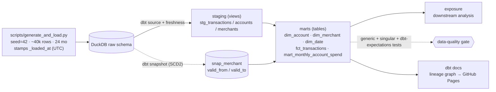

# finance-warehouse-dbt

> A **dbt-core + DuckDB** dimensional warehouse over the shared finance transaction corpus — star
> schema, **SCD Type 2** history, **data contracts**, a layered test suite, lineage docs, and CI.
> **Docker-free, $0, no cloud account.** Runs end-to-end on a laptop with `dbt build` and is gated in CI.

This is the **transform / modeling layer** of a four-repo portfolio over one shared `seed=42` finance
corpus — the piece an analytics engineer actually owns:

| Repo | Layer | Role |
|---|---|---|
| [`finance-pipeline`](https://github.com/HarshPatel7x/finance-pipeline) | ingestion / OLTP | source of the transaction data |
| [`lakehouse-iceberg-finance`](https://github.com/HarshPatel7x/lakehouse-iceberg-finance) | open-table storage | Iceberg table format, time-travel |
| [`finance-pipeline-rag`](https://github.com/HarshPatel7x/finance-pipeline-rag) | AI retrieval | RAG over the corpus |
| **this repo** | **transform / modeling** | **dbt star schema + SCD2 + tests + contracts** |

> Same corpus, different layer — deliberate portfolio cohesion, not the same dataset repeated. The
> generator here **expands** the corpus to ~40k rows over 24 months across multiple accounts and
> merchants whose attributes change over time, because SCD2 and freshness are only demonstrable on data
> that actually changes.

## Architecture



## What it demonstrates (and what backs it)

Backs the DE resume's *dbt Warehouse + SCD2 + CI/CD* project line. Concretely:
- **Dimensional modeling** — staging → marts star schema with a declared grain and surrogate keys.
- **SCD Type 2 history** — a `dbt snapshot` that captures real merchant attribute changes (exercised by a
  v1 → v2 reload, not a one-shot static load).
- **Data quality as a gate** — generic + singular + `dbt-expectations` tests + **enforced model contracts**
  + a YAML data contract (schema, freshness SLA, row-count baseline, consumer list), all blocking in CI.
- **Lineage + docs** — `dbt docs` DAG deployed to GitHub Pages.

## Metrics (TARGET until a real `dbt build` measures them — Step 8)

| Metric | Target | Measured |
|---|---|---|
| Models (staging + intermediate + marts) | — | TARGET |
| Data tests (generic + singular + expectations) | — | TARGET |
| Test pass rate | 100% | TARGET |
| % mart columns with ≥1 test | ≥ 70% | TARGET |
| Rows modeled (`fct_transactions`) | ~40k | TARGET |
| SCD2 rows versioned / closed-out | — | TARGET |
| `dbt build` wall-clock (CI runner) | — | TARGET |

## Quickstart

```bash
python3.12 -m venv venv && source venv/bin/activate   # Python 3.12 (NOT 3.14 — dbt #12098)
pip install -r requirements.txt
dbt deps --profiles-dir .
python scripts/generate_and_load.py                   # build the raw layer (Step 2+)
dbt build --profiles-dir .                            # run + test the whole warehouse
dbt docs generate --profiles-dir . && dbt docs serve  # explore the lineage graph
```

## Stack (pinned, verified on Python 3.12.2)

- **dbt-core 1.11.11 + dbt-duckdb 1.10.1** — transform + test framework over an embedded DuckDB warehouse.
- **dbt packages:** `dbt_utils`, `dbt_expectations` (the in-stack, $0 stand-in for Great Expectations).
- **CI:** GitHub Actions, Python 3.12, **zero secrets**. **Docs:** GitHub Pages.

## Honest limitations

- *(filled at Step 8)* — static-seed freshness caveat, single-writer DuckDB, and the cloud
  (Airflow/MWAA + S3/Snowflake) **promotion path** that is documented but not run here.

## Build notes

Beginner-language step retros + a concept glossary live in [`notes/`](notes/INDEX.md).
